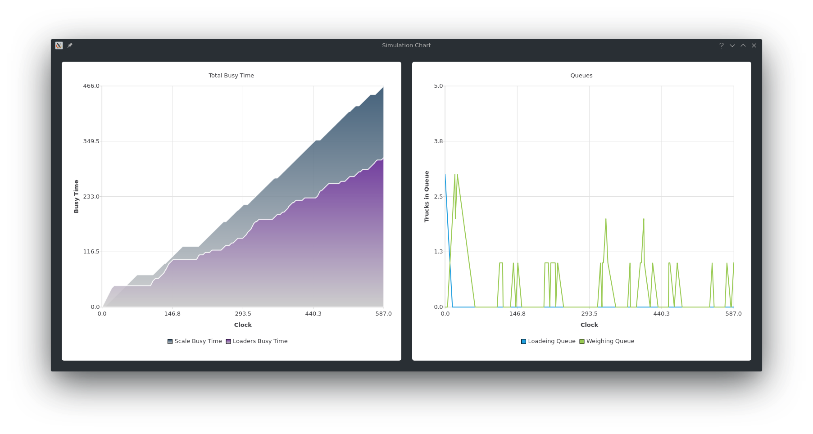

= Dump Truck Problem Simulation
Hesam Gholami <hesamgholami@yahoo.com>
v1.0, 2019-05-13

++++
<link rel="stylesheet"  href="http://cdnjs.cloudflare.com/ajax/libs/font-awesome/3.1.0/css/font-awesome.min.css">
++++
:icons: font
:experimental: true

image::misc/sample-images/dump-truck-simulation-result.png[Simulation result]

== Quick Start

This project is an implementation of the Dump-Truck problem simulation example of Discrete-Event System Simulation 4th edition written by Jerry Banks, John S. Carson II, Barry L. Nelson and David M. Nicol .

In this example we have some truks which are in a weghing queue. Also there is a scale which they should use, after these tasks, they should go back and repeat the tasks again.

In this project we are simulating this situation to find out how much time they spend in weghing queue and scale queue.

In order to run this project we need some tools which you can see below.

=== Qt

This project is written in _Qt_, so you need to install Qt to run this project.

https://qt.io

You don't need any other tools to run this project. Just open up `DiscreteEventSystemSimulation.pro` in *Qt Creator* and run the project.

== Class Description

Here you can see a summary about the code.

=== UI Classes

There is some classes which are used for user interface.

  * `MainWindow` which is the main application window that you can input data into.
  * `DialogSimulation` which is the window that shows the result of the simulation.
  * `DialogCharts` which is the window that will show statistics charts.
  
=== Simulation Items Classes

Some classes are used as simulation items.

  * `DumpTruck` which will act as a truck.
  * `Loader` which will act as a truck loader.
  * `Scale` which will act as a truck scale.
 
These items are used due code as our problem items.

=== Queues

We have some queues in our problem which we have relative classes for all of them.

  * `Queue` which is a base class for other queues.
  * `LoadingQueue` which will be used for keeping trucks that are waiting for loader.
  * `WeighQueue` which will be used for keeping trucks that are waiting for weghing.
  
These are holding trucks.

=== Event Management Classes

There is some classes for managing events.

  * `Event` which is a general type for handling events for every truck.
  * `FutureEventList` which will manage all events that are waiting for trucks.
  
These events actually will generate our result by passing of time.

=== Other Classes

  * `CumulativeStatistics` this class will hold the result of simulation iterations in a time based manner.
  * `DataProvider` this class will be used to generate required data of simulation iterations.
  
== Contributing

If you enjoyed this project, please consider contributing to it and make it better.

And please don’t forget to give a star to this project.

Thank you and happy coding!
